# otsu
Код к четвёртому домашнему заданию курса Архитектуры ЭВМ у2022 КТ ИТМО. Программа считает порог значений изображения в формате .pgm, используя [метод Оцу](https://ru.wikipedia.org/wiki/%D0%9C%D0%B5%D1%82%D0%BE%D0%B4_%D0%9E%D1%86%D1%83), обрабатывая изображение параллельно на процессоре с использованием API OpenMP и сохраняет изображение, обработанное порогом. [otsu_one.cpp](src/otsu_one.cpp) --- код, считающий один порог, [otsu.cpp](src/otsu.cpp) --- код, считающий три порога (метод мульти-Оцу).

Скрипт [convert_gif.sh](convert_gif.sh) проводит пороговую обработку файла .gif по кадрам и пересобирает обработанные изображения. Также для обработки gif-изображений трбуются пакеты **ffmpeg**, **libavformat**, **imagemagick**, **gcc** с поддержкой **openmp**.
## Формат ввода
`./otsu [n] [input image] [output image]` где n --- количество потоков (0 --- значение по умолчанию, -1 --- работа без OpenMP), а `./otsu` - исполняемый фаил, скомпилированный от исходника кода (с флагом `-fopenmp`)

`./convert_gif.sh [.cpp source file] [gif file]`
## Примеры
#### pgm
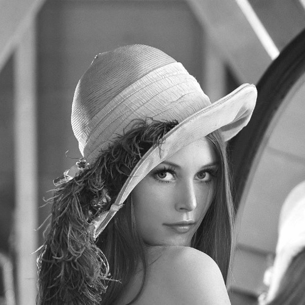 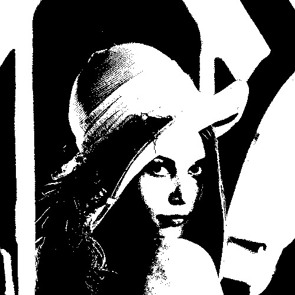 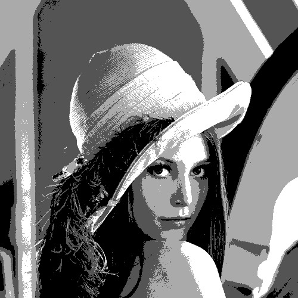
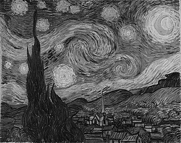 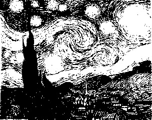 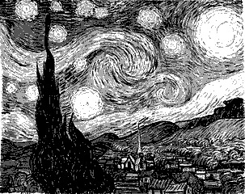
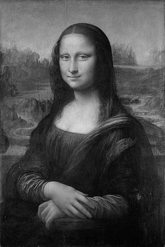 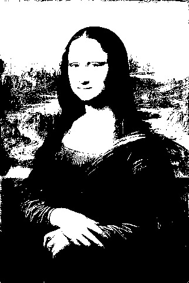 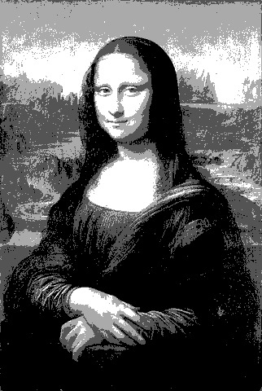
#### gif
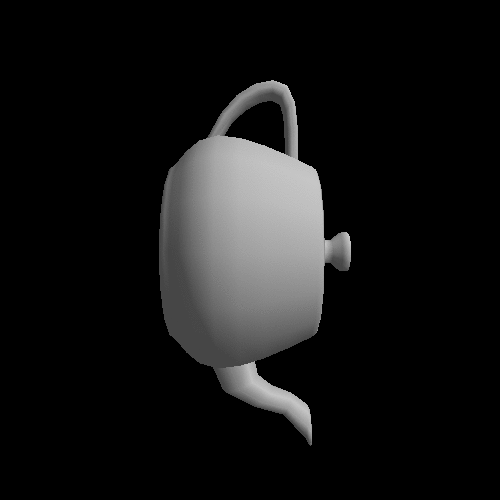 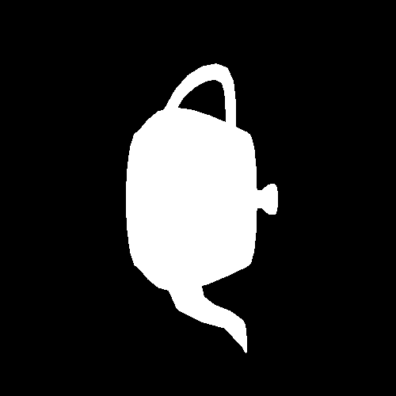 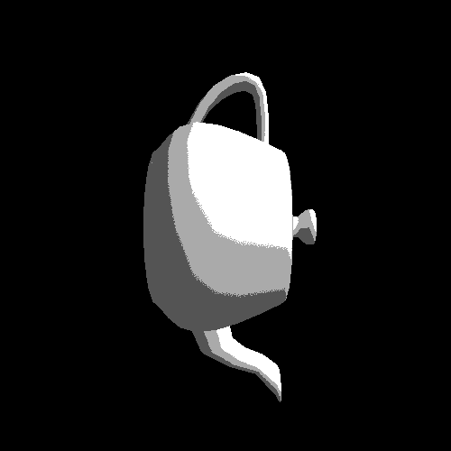
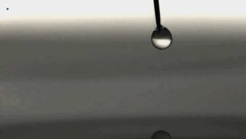 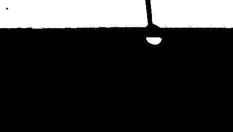 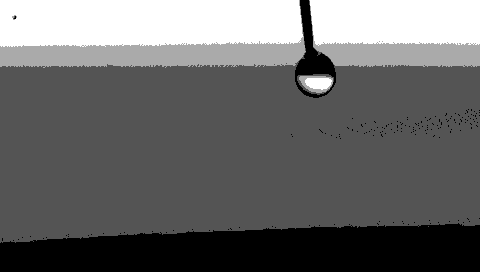
